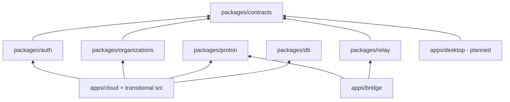

# Modular monorepo

Mailwarden uses one Bun repository because Cloud, Bridge, Desktop, shared protocols, migrations, tests, infrastructure, and operational truth must evolve together. The repository is a modular monolith at the product/domain level, not a promise that every component runs in one process.

## Current shape

```text
mailwarden/
├── apps/
│   ├── cloud/       # Cloud deploy composition; implementation transitions from /src
│   ├── bridge/      # Proton Gateway executable; daemon/CLI planned
│   └── desktop/     # Planned desktop boundary; technology open
├── packages/
│   ├── contracts/   # Cross-runtime protocol types
│   ├── db/          # Canonical Drizzle schema
│   ├── auth/        # Shared permission scopes
│   ├── organizations/
│   ├── proton/
│   └── relay/
├── infra/           # Cloudflare, AlmaLinux, systemd, packaging
├── migrations/      # Canonical ordered D1/local SQL migrations
├── src/             # Transitional Cloud implementation
├── tests/           # Existing test suite plus package-boundary checks
├── docs/
├── scripts/
├── package.json
├── bun.lock
└── wrangler.jsonc
```

The `/src` transition is deliberate. The checkout contained substantial uncommitted portal, OAuth, synchronization, and provider work during kickoff. Moving every file at once would have mixed an architectural rename with behavior changes and made review unsafe. New deploy composition and shared domains have canonical homes now; Cloud implementation slices can move incrementally with their tests.

## Dependency direction



Applications compose packages. Packages do not import applications. `packages/contracts` contains cross-boundary language, not every internal interface. `packages/db` owns the schema, while D1 client creation remains a Cloud runtime concern.

## Deployment boundaries

### Cloud

- Root command: `bun run deploy:dry` for a safe bundle; `bun run deploy` only when intentionally deploying.
- Wrangler config: `/wrangler.jsonc`.
- Worker entrypoint: `/apps/cloud/src/worker.ts`.
- D1 migrations: `/migrations`.
- Production ship workflow: `/scripts/ship.sh`.

The root config avoids working-directory tricks and keeps the existing Cloudflare bindings, cron, aliases, routes, and secrets model intact.

### Bridge

- Current command: `bun run proton:gateway` or `bun run dev:bridge`.
- Current entrypoint: `/apps/bridge/src/gateway.ts`.
- Current gateway implementation: transitional `/src/services/proton-gateway.ts`.

No Bridge release artifact is packaged yet.

### Desktop

No runtime or build exists. Do not add a root command until there is executable code.

## Database ownership

`packages/db/src/schema.ts` is the only canonical Drizzle schema. `/migrations` is the only canonical migration sequence. `drizzle.config.ts`, Wrangler, and the local migration runner all point to those locations.

Bridge and Desktop must not import the D1 client or schema to query production data. Their persistence boundary is an authenticated Cloud API. Types that cross that boundary belong in `packages/contracts`, not the database package.

## Testing

- `bun test`: repository suite; currently includes Cloud unit/integration/security behavior and shared foundation checks.
- `bun run typecheck`: Cloud/UI TypeScript check. Point-in-time failures are recorded in the next-session handoff.
- `bun run build`: safe Wrangler dry-run bundle; does not deploy.
- `bun run test:live`: production-oriented interactive verification; never run as a default gate.

Keep existing tests where they are until moving them clarifies ownership. New cross-tenant attack tests belong in `tests/security`; Bridge tests should live next to Bridge or under a clearly named root suite once a daemon exists.

## Adding a package

Create a package only when it owns reusable domain logic or a cross-runtime contract:

1. Add `packages/<name>/package.json` with a private `@mailwarden/<name>` name and explicit exports.
2. Declare each workspace dependency with `workspace:*`.
3. Add the root dependency only if transitional root code consumes it.
4. Export the smallest public surface; avoid barrel layers inside tiny packages.
5. Leave one runnable check for non-trivial logic.
6. Update this document and `SHARED_CONTRACTS.md` if a boundary changes.

## Adding an application

An application must be separately runnable or deployable, compose packages rather than redefine them, document its runtime/secrets, and provide a root command only when useful. Do not create an application directory merely to reserve a speculative feature; Desktop is the sole exception because the technology decision is intentionally open and its boundary prevents Bridge Core from coupling to a GUI.
