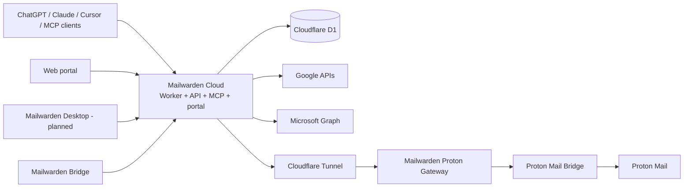

# Mailwarden architecture overview

Status vocabulary used in these documents:

- **SHIPPED**: implemented in the repository and part of the established product path.
- **PARTIAL**: some implementation exists, but the described product boundary or workflow is incomplete.
- **PLANNED**: architecture only; do not depend on it at runtime.

## Product surfaces

### Mailwarden Cloud

**SHIPPED.** A Cloudflare Worker composes Hono HTTP routes, Solid SSR pages, OAuth, MCP, mailbox intelligence, synchronization, D1 persistence, encryption, policy enforcement, audit events, and human-confirmed sending. `apps/cloud/src/worker.ts` is the Wrangler entrypoint. The current implementation remains under `/src` during the incremental monorepo transition.

Only Cloud may talk directly to D1. Portal and MCP execute within the Cloud application. Bridge and future Desktop communicate with Cloud over authenticated protocols.

### Mailwarden Bridge

**PARTIAL.** `apps/bridge` is now the executable boundary for the existing Proton Gateway. The gateway can use per-request Proton Bridge credentials to serve multiple configured accounts through one process. Connector registration and heartbeat APIs already exist in Cloud, but there is no standalone Bridge daemon, provisioning flow, organization relay registration, CLI, installer, repair flow, or managed tunnel provisioning yet.

### Mailwarden Desktop

**PLANNED.** `apps/desktop` reserves the product boundary without choosing Tauri, Electron, or a native toolkit. Desktop will manage Bridge and onboarding; it will never connect directly to D1.

## Shared packages

| Package | Status | Responsibility |
| --- | --- | --- |
| `@mailwarden/contracts` | FOUNDATION | Cross-runtime workspace, mailbox, relay, provisioning, capability, and error types |
| `@mailwarden/db` | SHIPPED/TRANSITIONAL | Canonical Drizzle D1 schema; Cloud runtime adapter remains in `/src/db` |
| `@mailwarden/auth` | SHIPPED/FOUNDATION | Canonical MCP/API scopes and pure scope check |
| `@mailwarden/organizations` | FOUNDATION | Workspace membership and role primitives; Team workflows are not implemented |
| `@mailwarden/proton` | SHIPPED/FOUNDATION | Proton credential contract and gateway URL trust-boundary validation |
| `@mailwarden/relay` | FOUNDATION | Shared relay health primitives |

Packages for `crypto`, `mail`, and `ui` were not created during kickoff because their current logic is still Cloud-specific. Create them only when a second real consumer or a clean domain extraction exists.

## Persistence and tenancy

**SHIPPED:** nearly all stored product data carries `tenant_id` and `user_id`; service queries enforce both where user ownership matters. Provider credentials are envelope-encrypted with tenant/user-bound additional authenticated data.

**PARTIAL:** `tenants`, `users`, and `memberships` exist, but the identity model still binds each user row directly to one tenant and tokens resolve one tenant. Memberships are created for personal owners but are not yet the authorization source for multi-workspace access. See [ORGANIZATIONS.md](./ORGANIZATIONS.md).

## Safety invariants

- `MAILBOX_MUTATIONS_ENABLED=false` remains the production default and current live setting.
- Sending requires a human-reviewed approval bound to the exact payload.
- No permanent-delete operation reaches a provider adapter.
- Provider and relay secrets must never reach MCP clients, UI logs, source control, or audit details.
- Cross-workspace access must be derived from authenticated membership, never a caller-supplied tenant ID.

## Start here next

- Repository boundaries: [MONOREPO.md](./MONOREPO.md)
- Organization reality and migration constraints: [ORGANIZATIONS.md](./ORGANIZATIONS.md)
- Bridge product boundary: [MAILWARDEN_BRIDGE.md](./MAILWARDEN_BRIDGE.md)
- Proton data path: [PROTON_RELAY.md](./PROTON_RELAY.md)
- Security controls: [SECURITY.md](./SECURITY.md)
- MCP tenancy direction: [MCP.md](./MCP.md)
