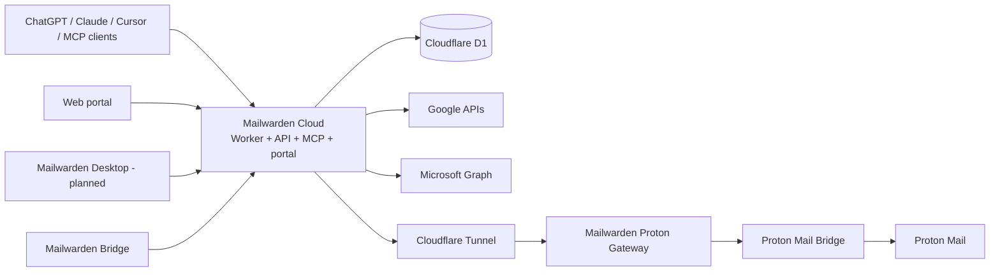

# Mailwarden architecture overview

Status vocabulary used in these documents:

- **SHIPPED**: implemented in the repository and part of the established product path.
- **PARTIAL**: some implementation exists, but the described product boundary or workflow is incomplete.
- **PLANNED**: architecture only; do not depend on it at runtime.

## Product surfaces

### Mailwarden Cloud

**SHIPPED.** A Cloudflare Worker composes Hono HTTP routes, Solid SSR pages, OAuth, MCP, mailbox intelligence, synchronization, D1 persistence, encryption, policy enforcement, audit events, and human-confirmed sending. `apps/cloud/src/worker.ts` is the Wrangler entrypoint. The current implementation remains under `/src` during the incremental monorepo transition.

Only Cloud may talk directly to D1. Portal and MCP execute within the Cloud application. Bridge and future Desktop communicate with Cloud over authenticated protocols.

### Mailwarden Bridge

**PARTIAL.** `apps/bridge` contains Bridge Core, a daemon, CLI, loopback local API, Proton discovery and gateway, device identity, health/diagnostics, repair primitives, Cloudflare Tunnel process management, and secret storage. Cloud implements the matching versioned provisioning, heartbeat, renewal, and revocation protocol. The AlmaLinux/systemd reference path exists; managed tunnel allocation, signed release packaging, non-Linux service adapters, and automatic updates do not.

### Mailwarden Desktop

**PARTIAL.** `apps/desktop` is a small Bun loopback companion that reads Bridge health and renders the management surface. It is not a packaged native desktop product, and no Tauri/Electron/native toolkit decision has been made. Desktop never connects directly to D1.

## Shared packages

| Package | Status | Responsibility |
| --- | --- | --- |
| `@mailwarden/contracts` | FOUNDATION | Cross-runtime workspace, mailbox, relay, provisioning, capability, and error types |
| `@mailwarden/db` | SHIPPED/TRANSITIONAL | Canonical Drizzle D1 schema; Cloud runtime adapter remains in `/src/db` |
| `@mailwarden/auth` | SHIPPED/FOUNDATION | Canonical MCP/API scopes and pure scope check |
| `@mailwarden/organizations` | SHIPPED | Role ordering and centralized Personal/Team/Enterprise capabilities |
| `@mailwarden/proton` | SHIPPED | Proton contracts, gateway URL validation, and Bridge discovery |
| `@mailwarden/relay` | SHIPPED | Shared health/diagnostic interpretation and gateway request authentication |
| `@mailwarden/ui` | PARTIAL | Shared status, diagnostic, and presentation primitives for portal/Desktop |

Packages for `crypto` and `mail` were not created because their current behavior remains Cloud-specific. Extract them only when a second real consumer or a clean domain boundary exists.

## Persistence and tenancy

**SHIPPED:** nearly all stored product data carries `tenant_id` and `user_id`; service queries enforce both where user ownership matters. Provider credentials are envelope-encrypted with tenant/user-bound additional authenticated data.

**SHIPPED/PENDING MIGRATION:** `users.id` is the global identity, while `users.tenant_id` remains the unchanged Personal Workspace compatibility and encryption anchor. Team Organizations are `tenants.kind=team`; memberships are the live authorization source. Tokens resolve exactly one active workspace and revalidate membership. Additive migrations `0006` and `0007` preserve all existing IDs and ciphertext. See [ORGANIZATIONS.md](./ORGANIZATIONS.md).

## Safety invariants

- `MAILBOX_MUTATIONS_ENABLED=false` remains the production default and current live setting.
- Sending requires a human-reviewed approval bound to the exact payload.
- No permanent-delete operation reaches a provider adapter.
- Provider and relay secrets must never reach MCP clients, UI logs, source control, or audit details.
- Cross-workspace access must be derived from authenticated membership, never a caller-supplied tenant ID.

## Start here next

- Repository boundaries: [MONOREPO.md](./MONOREPO.md)
- Organization reality and migration constraints: [ORGANIZATIONS.md](./ORGANIZATIONS.md)
- Bridge product boundary: [MAILWARDEN_BRIDGE.md](./MAILWARDEN_BRIDGE.md)
- Proton data path: [PROTON_RELAY.md](./PROTON_RELAY.md)
- Security controls: [SECURITY.md](./SECURITY.md)
- MCP tenancy direction: [MCP.md](./MCP.md)
